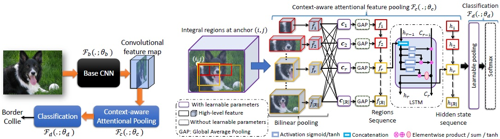
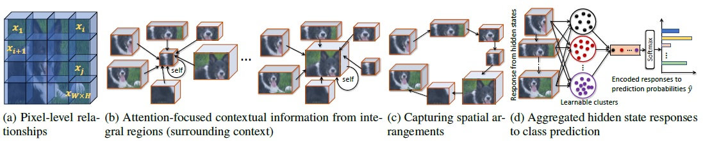

## Ardhendu Behera, Zachary Wharton, Pradeep Hewage and Asish Bera
**Department of Computer Science, Edge Hill University, United Kingdom**

### Abstract
Deep convolutional neural networks (CNNs) have shown a strong ability in mining discriminative object pose and parts information for image recognition. For fine-grained recognition, context-aware rich feature representation of object/scene plays a key role since it exhibits a significant variance in the same subcategory and subtle variance among different subcategories. Finding the subtle variance that fully characterizes the object/scene is not straightforward. To address this, we propose a novel context-aware attentional pooling (CAP) that effectively captures subtle changes via sub-pixel gradients, and learns to attend informative integral regions and their importance in discriminating different subcategories without requiring the bounding-box and/or distinguishable part annotations. We also introduce a novel feature encoding by considering the intrinsic consistency between the informativeness of the integral regions and their spatial structures to capture the semantic correlation among them. Our approach is simple yet extremely effective and can be easily applied on top of a standard classification backbone network. We evaluate our approach using six state-of-the-art (SotA) backbone networks and eight benchmark datasets. Our method significantly outperforms the SotA approaches on six datasets and is very competitive with the remaining two.

### Context-aware Attentional Pooling (CAP)
Our CAP is designed to encode spatial arrangements and visual appearance of the parts effectively. The module takes input as a convolutional feature from a base CNN and then _learns to emphasize_ the latent representation of multiple integral regions (varying coarseness) to describe hierarchies within objects and parts. Each region has an anchor in the feature map, and thus many regions have the same anchor due to the integral characteristics. These integral regions are then fed into a recurrent network (e.g. LSTM) to capture their spatial arrangements, and is inspired by the visual recognition literature, which suggests that humans do not focus their attention on an entire scene at once. Instead, they focus sequentially by attending different parts to extract relevant information. A vital characteristic of our CAP is that it generates a new feature map by focusing on a given region conditioned on all other regions and itself.


**High-level illustration of our model (left). The detailed architecture of our novel CAP (right).**


**Learning pixel-level relationships from the convolutional feature map of size _W x H x C_. b) CAP using integral regions to capture both self and neighborhood contextual information. c) Encapsulating spatial structure of the integral regions using an LSTM. d) Classification by learnable aggregation of hidden states of the LSTM.**

### Paper and Supplementary Information
Extended version of the accepted paper in [ArXiv](https://arxiv.org/abs/2101.06635).

[Supplementary Document](AAAI_Supplementary.pdf)

[Source code](https://github.com/ArdhenduBehera/cap)

### Bibtex
```markdown
@inproceedings{behera2021context,
  title={Context-aware Attentional Pooling (CAP) for Fine-grained Visual Classification},
  author={Behera, Ardhendu and Wharton, Zachary and Hewage, Pradeep and Bera, Asish},
  booktitle={The Thirty-Fifth AAAI Conference on Artificial Intelligence},
  year={2021},
  organization={AAAI}
}
```

### Acknowledgements

This research was supported by the UKIERI (CHARM) under grant DST UKIERI-2018-19-10. The GPU is kindly donated by the NVIDIA Corporation.
